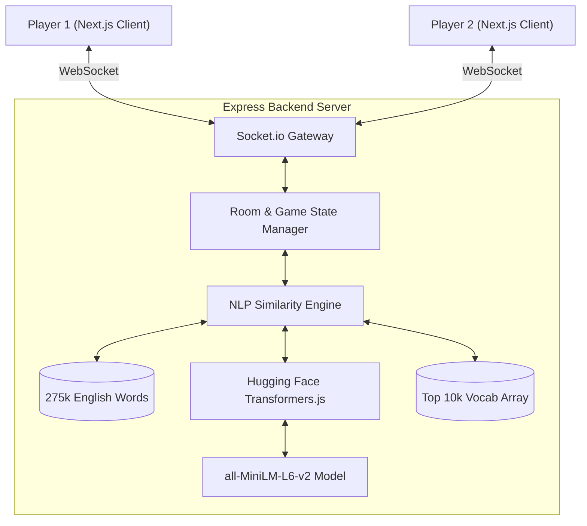
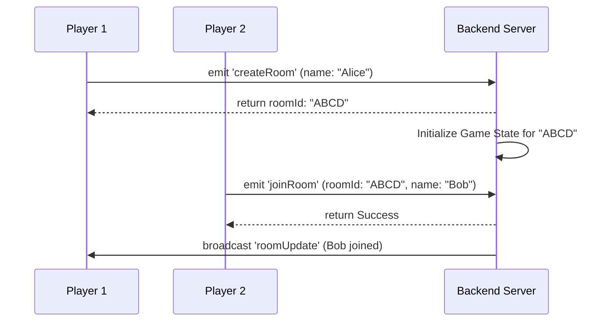
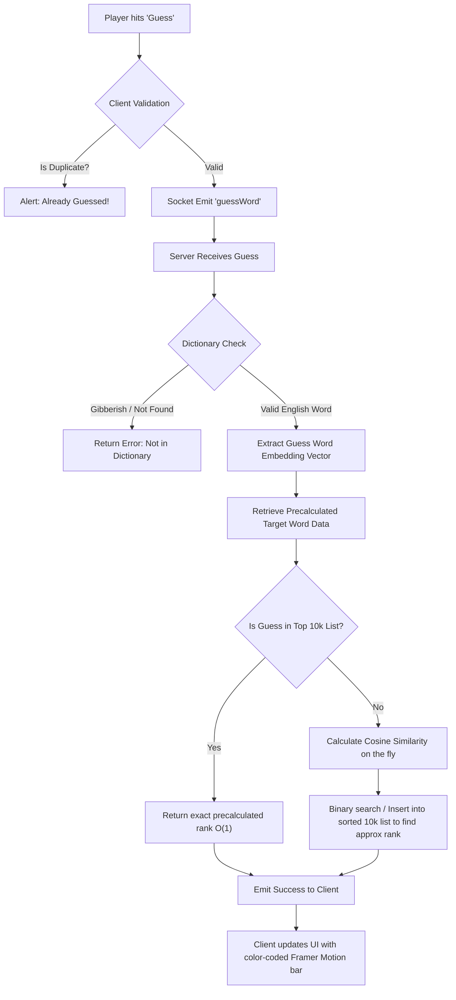

# GuessRadius 🎯

Welcome to **GuessRadius**, a highly interactive, real-time multiplayer semantic word-guessing game inspired by Contexto. Instead of playing against a pre-determined daily word, GuessRadius lets players create private rooms where *everyone* chooses a secret word, and everyone races to guess each other's words based on AI-powered semantic similarity.

## 🚀 Features

- **Real-Time Multiplayer:** Built on WebSockets (Socket.io) for instantaneous updates across all connected clients.
- **AI Semantic Word Ranking:** Powered by Hugging Face Transformers (`@xenova/transformers` with `all-MiniLM-L6-v2`), generating highly accurate mathematical representations (embeddings) of English words.
- **Fair Gameplay Validation:** Employs a strict validation check against a dictionary of ~275,000 real English words to prevent "gibberish" guessing.
- **Absolute Ranking:** Pre-calculates the absolute rank of target words against a dictionary of the top 10,000 most common English words.
- **Glassmorphism UI:** A sleek, premium Next.js frontend featuring dynamic CSS, custom color mapping, and fluid `framer-motion` animations.

---

## 🧠 How it Works (Game Logic)

1. **Room Creation:** A player creates a room and receives a 4-letter room code.
2. **Lobby & Word Selection:** Other players join using the code. Every player inputs a secret "Target Word."
3. **The AI Engine:** Once a Target Word is set, the Node.js server passes the word through a Transformer model to extract its semantic vector. It then calculates the Cosine Similarity of this vector against the 10,000 most common English words, creating a definitive, sorted absolute ranking (1 to 10,000).
4. **The Guessing Phase:** Players begin typing guesses. The server checks the dictionary to validate the word, calculates its similarity to the specific opponent's target word, and returns its absolute rank.
5. **Winning:** The first player to reach Rank #1 (the exact target word) gets 1000 points!

---

## 🏗️ System Architecture

GuessRadius is divided into two distinct services:
- **Client:** A Next.js 14+ application handling UI/UX, Socket.io client connections, and client-side validation.
- **Server:** An Express Node.js application managing the WebSockets, the active game state in memory, and the intensive NLP processing.

### High-Level Architecture Diagram



---

## 🌊 Application Flowcharts

### 1. Room Creation & Joining Flow



### 2. The NLP Ranking & Guessing Flow

This illustrates the complex AI pipeline executed when a player submits a guess.



---

## 🎨 Color Coding Scale

To give players immediate visual feedback on how close they are to the target word, the frontend dynamically maps the absolute rank to specific color hexes and visual bar widths:

| Rank Range | Closeness | CSS Color | Hex Code | Visual Representation |
| :--- | :--- | :--- | :--- | :--- |
| **#1** | **Exact Match!** | Green | `#22c55e` | 100% Width + Glow |
| **2 - 100** | Very Close | Light Green | `#86efac` | ~99% Width |
| **101 - 500** | Close | Yellow | `#facc15` | ~95% - 99% Width |
| **501 - 10,000** | Far | Orange | `#fb923c` | ~5% - 95% Width |
| **> 10,000** | Very Far | Red | `#f87171` | < 5% Width |

---

## 🛠️ Setup & Installation

### Prerequisites
- Node.js (v18 or higher recommended)
- npm or yarn

### 1. Clone the Repository
```bash
git clone https://github.com/Abhinav-2312307/GuessRadius.git
cd GuessRadius
```

### 2. Backend Setup
```bash
cd server
npm install
node index.js
```
*(Note: On the very first run, the server will download the ~20MB transformer model into cache. It will also load the dictionary and pre-calculate core vocabulary. Please wait for "NLP Engine Initialized" in the console.)*

### 3. Frontend Setup
Open a new terminal window:
```bash
cd client
npm install
npm run dev
```

The client will be available at [http://localhost:3000](http://localhost:3000).

---

## 📂 Project Structure

```text
GuessRadius/
├── client/                     # Next.js Frontend
│   ├── src/app/
│   │   ├── globals.css         # Glassmorphism design system & rank colors
│   │   ├── layout.js           # Next.js Root Layout
│   │   ├── page.js             # Landing Page (Room Create/Join)
│   │   └── room/page.js        # Main Game Interface & WebSockets Client
│   ├── package.json
│   └── next.config.mjs
└── server/                     # Node.js Express Backend
    ├── index.js                # Express Server, Socket.io Events, Game State
    ├── nlp.js                  # Transformers.js NLP Engine & Dictionary Validator
    ├── data/
    │   └── 10k.txt             # Top 10,000 English Words vocabulary
    └── package.json
```

---

## 🔧 Technologies Used

- **Frontend:** React, Next.js 14, Framer Motion, Vanilla CSS (Glassmorphism UI)
- **Backend:** Node.js, Express, Socket.io
- **AI / NLP:** Hugging Face `@xenova/transformers`, `an-array-of-english-words`, `natural` (Stemmer capabilities)
- **Icons:** Lucide React
